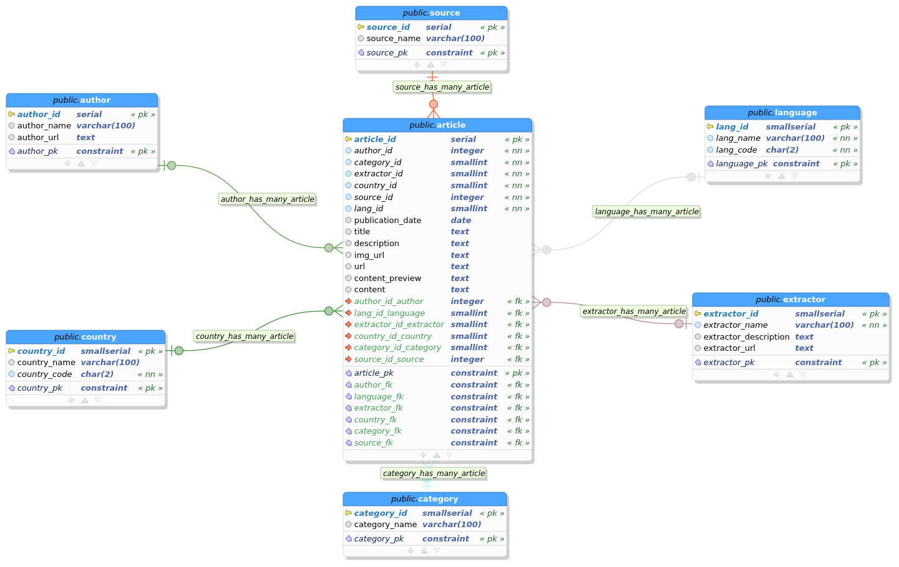
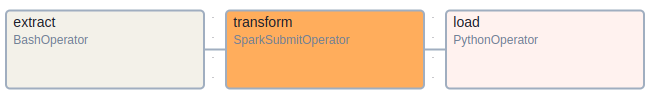

# Africa-News-API

## Table of Contents
1. [Summary](#summary)
2. [Features](#features)
3. [Tools](#tools)
4. [Architecture](#architecture)
5. [Database Design](#database-design)
6. [Installation](#installation)
   - [Prerequisites](#prerequisites)
   - [Setup Steps](#setup-steps)
7. [Usage](#usage)
8. [API Endpoints](#api-endpoints)
9. [ETL Pipeline](#etl-pipeline)
10. [Contributing](#contributing)
11. [License](#license)
12. [Contact Information](#contact-information)

## Summary
The Africa-News-API is a personal project designed to aggregate news from various African media platforms and existing news APIs into a centralized database. News articles are retrieved, transformed, and stored hourly, making them accessible to users through dedicated API endpoints, facilitating easy access to news events across the continent.

## Features
- Aggregates news from multiple African media websites and news APIs.
- Efficiently processes large volumes of news articles using Apache Spark.
- Stores news articles in a PostgreSQL database.
- Provides a FastAPI-based API for accessing news data.
- Automated ETL (Extract, Transform, Load) pipeline using Apache Airflow.
- Supports containerized deployment with Docker and Docker Compose.

## Tools
- **PgModeler**: For database modeling and design.
- **PostgreSQL**: Relational database management system for storing news articles.
- **SQLAlchemy**: For database interaction and management, serving as an Object-Relational Mapping (ORM) tool.
- **Python**: Primary programming language for data retrieval and processing.
- **Selenium**: For web scraping news articles from media websites.
- **Apache Spark**: For processing and analyzing large volumes of news data efficiently.
- **Apache Airflow**: To orchestrate and automate data workflows and ETL processes.
- **FastAPI**: To create a performant and easy-to-use API for accessing news data.
- **Docker**: For containerizing the application to ensure consistency across different environments.
- **Docker Compose**: For defining and managing multi-container Docker applications, simplifying the setup and orchestration of services.
- **Bash**: For scripting tasks related to database initialization, Airflow user and connection initialization, etc.

## Skills
- **Web Scraping**: Extracted data from dynamic web pages using automation.
- **API Design**: Created efficient, scalable REST APIs for data access.
- **ETL Pipelines**: Automated extraction, transformation, and loading of data.
- **Data Processing**: Performed large-scale data transformation and cleansing.
- **Database Management**: Designed optimized relational databases for storing large datasets.
- **Task Automation**: Developed scripts for system management and task scheduling.
- **Containerization**: Ensured consistency in multi-service deployments using containers.

<!--## Architecture
*Detailed architecture diagram and explanation here (if available).*-->

## Database Design
The database design for the Africa-News-API is structured to efficiently store and retrieve news articles. It organizes data into well-defined tables to support rapid querying and scalability. Below is an Entity-Relationship (ER) diagram (ERD) that outlines the structure of the database, **africa_news_db**, designed using **PgModeler**.




The diagram illustrates the relationships between these entities, such as how each article is linked to a media source and categorized under specific tags.

### Model Files:
- **Database Model**: The ER model file generated using PgModeler can be found [here](./database/design/design.dbm) in the repository.
- **SQL File**: [Here](./database/init/utils/create_tables.sql) is the SQL file used to create the database schema. It is generated in PgModeler.

This design ensures the Africa-News-API can scale as the volume of news articles grows while maintaining quick access to information through efficient database queries.


## API endpoints

### 1. **Root Endpoint**

- **Endpoint**: `/`
- **Method**: `GET`
- **Description**: Returns a welcome message.
- **Response**: 
    ```json
    "Welcome to Africa News API"
    ```

### 2. **Get all Languages**

- **Endpoint**: `/languages`
- **Method**: `GET`
- **Description**: Retrieve a list of all languages available in the database.
- **Response**: A list of languages in the following format:

    ```json
    [
    {
        "id": 1,
        "name": "english",
        "code": "en"
    },
    {
        "id": 2,
        "name": "french",
        "code": "fr"
    }
    ]
    ```

---

### 3. **Get all Countries**

- **Endpoint**: `/countries`
- **Method**: `GET`
- **Description**: Retrieve a list of all countries available in the database.
- **Response**: A list of countries in the following format:

    ```json
        [
    {
        "id": 1,
        "name": "algeria",
        "code": "DZ"
    },
    {
        "id": 2,
        "name": "angola",
        "code": "AO"
    },
    {
        "id": 3,
        "name": "benin",
        "code": "BJ"
    },
    
    
    {
        "id": 54,
        "name": "zambia",
        "code": "ZM"
    },
    {
        "id": 55,
        "name": "zimbabwe",
        "code": "ZW"
    },
    {
        "id": 56,
        "name": null,
        "code": "ZZ"
    }
    ]
    ```

---

### 4. **Get all Categories**

- **Endpoint**: `/categories`
- **Method**: `GET`
- **Description**: Retrieve a list of all categories available in the database.
- **Response**: A list of categories in the following format:

    ```json
        [
    {
        "id": 1,
        "name": "analysis-interpretation"
    },
    {
        "id": 2,
        "name": "business-economy-finance"
    },
    {
        "id": 3,
        "name": "celebrity"
    },

    {
        "id": 18,
        "name": "music"
    },
    {
        "id": 19,
        "name": "council of ministers"
    },
    {
        "id": 20,
        "name": null
    }
    ]
    ```

---

### 5. **Get all Authors**

- **Endpoint**: `/authors`
- **Method**: `GET`
- **Description**: Retrieve a list of all authors available in the database.
- **Response**: A list of authors in the following format:

    ```json
    [
      {
    "id": 1,
    "name": null,
    "URL": null
  },
  {
    "id": 2,
    "name": "Romaric Déguénon",
    "URL": "https://beninwebtv.com/author/romaric/"
  },
  {
    "id": 3,
    "name": "Leandro Zomassi",
    "URL": "https://beninwebtv.com/author/libence/"
  },
  {
    "id": 8,
    "name": "Edouard Djogbénou",
    "URL": "https://beninwebtv.com/author/edouard/"
  }
    ]
    ```

---

### 6. **Get all Articles**

- **Endpoint**: `/articles`
- **Method**: `GET`
- **Description**: Retrieve a list of articles based on various filters.
- **Query Parameters**: They are all optional
  - `country`: Filter articles by country (either country name or country code).
  - `lang`: Filter articles by language (either language name or language code).
  - `category`: Filter articles by category name.
  - `author`: Filter articles by author name.
  - `source`: Filter articles by source name.
  - `start_date`: Start date for filtering by publication date (in `YYYY-MM-DD` format).
  - `end_date`: End date for filtering by publication date (in `YYYY-MM-DD` format).
  - `order_by`: Field to order the results by (default is `publication_date`).
  - `order`: Sort order, either `asc` or `desc` (default is `desc`).
  - `limit`: Maximum number of articles to return (default is 10, maximum is 100).
  - `offset`: Number of articles to skip for pagination (default is 0).

- **Response**: A list of articles in the following format:

    ```json
    [
      {
    "id": 31,
    "author": {
      "id": 1,
      "name": null,
      "url": null
    },
    "category": {
      "id": 20,
      "name": null
    },
    "source": {
      "id": 9,
      "name": "Nation"
    },
    "country": {
      "id": 34,
      "name": "morocco",
      "code": "MA"
    },
    "language": {
      "id": 1,
      "name": "english",
      "code": "en"
    },
    "publication_date": "None",
    "title": "Western Sahara issue threatens Morocco’s business deals",
    "description": "The Western Sahara region was initially a colony of Spain but after the colonialists departed, it was administered by Mauritania and Morocco before Morocco...",
    "img_url": "data:image/gif;base64,R0lGODlhAQABAIAAAP///////yH5BAEKAAEALAAAAAABAAEAAAICTAEAOw==",
    "url": "https://nation.africa/kenya/news/africa/western-sahara-issue-threatens-morocco-s-business-deals-4793176&ved=2ahUKEwjp2PLOz4uJAxUu48kDHfy5OLoQxfQBegQIBxAC&usg=AOvVaw3Ia4CCqqIvc0_oR66GvXxv",
    "content_preview": null,
    "content": null
  }
    ]
    ```

---


### ETL Pipeline

The ETL (Extract, Transform, Load) process in this project is implemented using Apache Airflow, facilitating the hourly workflow for fetching news articles from multiple sources, transforming the data, and loading it into a PostgreSQL database. The following figures shows the ETL DAG.



#### Components of the ETL Process

1. **Extract**:
   - The extraction task is executed using a `BashOperator`, which runs multiple Python scripts **concurrently** to retrieve news articles from various sources of two types
        - **African media websites**:
            - News are scraped from Africa media platforms using **Selenium** with **chrome web driver**
            - The following websites were used:
                - [Benin Web TV](https://beninwebtv.com/)
                - [Jeune Afrique](https://www.jeuneafrique.com/)
                - [Africa Confidential](https://africa-confidential.com/)
        - **External News APIs**
            - News are fetched from external news APIs by specifying african countries as query keywords.
            - The following external news APIs were used:
                - [Google News API](https://news.google.com/)
                - [News API](https://newsapi.org/)
  - The news retrieved are stored in a staging area in a seperate CSV file file, for each news source.
  - These scripts are located in the [etl/extract/scrapers/](./src/etl/extract/scrapers/) and [etl/extract/external_apis/](./src/etl/extract/external_apis/).

2. **Transform**:

   The transformation step utilizes the `SparkSubmitOperator` to run a Spark application, specified in the [etl/transform/transform.py](./src/etl/transform/transform.py) file. 
  This application:
      - Retrieves the extracted news from the staging area.
      - Drops duplicate records to ensure uniqueness in the data.
      - Converts country and category names to lowercase for standardization.
      - Removes accents from country and category names.
      - Translates country names from French to English using a predefined mapping.
      - Filters out invalid country names like "africa," "monde," or "moyen-orient."
      - Standardizes the category names by mapping them to predefined, relevant labels such as "sport," "business-economy-finance," "politics," etc.
      - Performs the following transformation to format the publication date:
        - Splits the publication date into day, month, and year components for further manipulation.
        - Transforms French month names into corresponding numerical values.
        - Reconstructs and formats the publication date, converting it to a consistent yyyy-MM-dd format.
      - Writes the transformed data back into the staging area as a CSV file for loading.

3. **Load**:

   The loading task is handled by a `PythonOperator`, which calls the `load` function defined in [src/etl/load/load.py](./src/etl/load/load.py). This step:
      - Establishes a connection to a PostgreSQL database using SQLAlchemy.
      - Reads the transformed CSV files from the staging area.
      - For each article in the CSV files, it inserts the data into the relevant database tables by:
        - Ensuring that the article's author, source, and category exist in the database, creating new entries if they do not.
        - Retrieving existing records for country, language, and extractor from the database.
        - Checking if the article already exists in the database based on key attributes such as author, category, country, language, source, and publication date.
      - If the article does not already exist, a new entry is inserted into the database with all associated details like title, description, publication date, and content.
      


#### Workflow Scheduling

- The entire ETL process is scheduled to run every hour, ensuring that the database is updated with the latest news articles.


<!-- 
## Installation
### Prerequisites
*List any prerequisites needed before installation (e.g., Docker, Python, etc.).*

### Setup Steps
*Step-by-step guide to set up the project environment, including commands for Docker and installation of dependencies.*

## Usage
*Instructions on how to run the project and any configuration options.*


## Contributing
*Guidelines for contributing to the project.*

## License
*Specify the license under which the project is distributed.*-->

## Contributing

We welcome contributions to enhance the project! To ensure a smooth and efficient collaboration, please follow these guidelines:

### How to Contribute

1. **Fork the Repository**: 
   - Start by forking the project repository to your own GitHub account.

2. **Clone Your Fork**:
   - Clone the repository to your local machine using:
     ```bash
     git clone https://github.com/your-username/your-repo-name.git
     ```

3. **Create a Branch**:
   - Create a new branch for your feature or bug fix:
     ```bash
     git checkout -b feature-name
     ```

4. **Make Your Changes**:
   - Implement your changes, making sure to follow the project's coding standards and guidelines.
   - Include appropriate tests for new features or bug fixes.

5. **Commit Your Changes**:
   - Commit your changes with clear and descriptive commit messages:
     ```bash
     git commit -m "Add detailed description of the feature or fix"
     ```

6. **Push Your Branch**:
   - Push your branch to your fork:
     ```bash
     git push origin feature-name
     ```

7. **Open a Pull Request**:
   - Go to the original repository and open a Pull Request (PR) from your branch. Provide a detailed description of your changes and why they are needed.
   - Make sure your PR references any relevant issues (if applicable).

### Guidelines

- **Code Style**: Ensure your code follows the project's style guide.
- **Testing**: All contributions must pass the tests. Ensure that you have written or updated tests as necessary.
- **Documentation**: Update or add documentation where necessary, especially for new features or configuration changes.
- **Feedback and Reviews**: Be open to feedback during the review process, and address any requested changes promptly.

---

### Thank you for your contribution!

## License

This project is licensed under the **GNU General Public License v3.0**. You are free to use, modify, and distribute the code under the following terms:

- **Freedom**: You may use this software for any purpose and modify it as needed.
- **Open Source**: Any changes or modifications you make must be distributed under the same license.
- **Attribution**: You must give appropriate credit and provide a link to the license when distributing the software.
- **No Warranty**: This software is provided without any warranties, whether expressed or implied.

For more details, please see the full license in the [LICENSE](./LICENSE) file or visit the [GNU General Public License v3.0](https://www.gnu.org/licenses/gpl-3.0.en.html) for more information.

## Contact Information

For questions or issues, please contact:

- Name: Gbètoho Ezéchiel ADEDE
- Email: Gbetoho.ADEDE@um6p.ma
- GitHub: [Starias22](https://github.com/Starias22)
- LinkedIn: [Gbètoho Ezéchiel ADEDE](https://www.linkedin.com/in/Starias22)